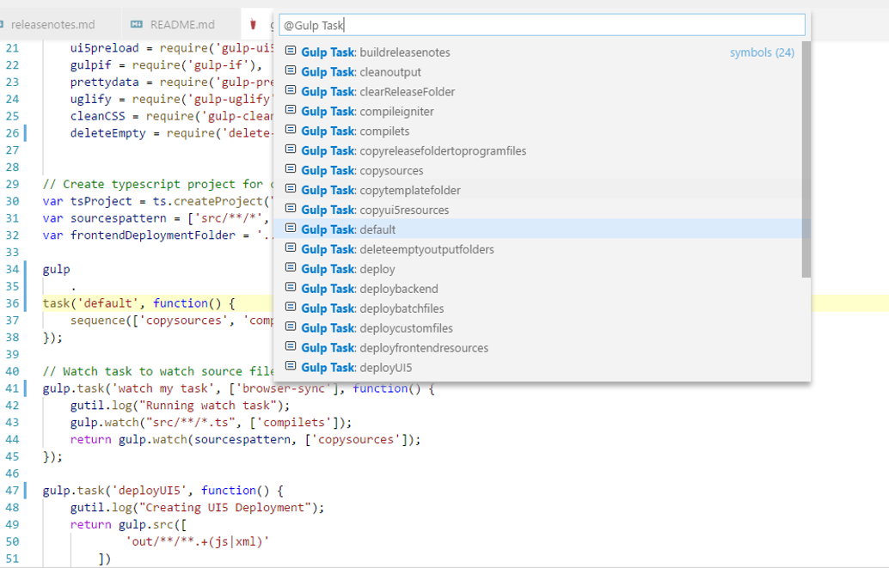

# Gulp Task Symbols provider

If you have many tasks in your gulpfile finding the right one can be pretty annoying.

This extension adds gulp tasks to the symbol provider. Just open your symbol search field (`CTRL+SHIFT+O`) and type `Gulp Task:` to get all your tasks in your gulpfile.js or type the name of your task to search for it.

